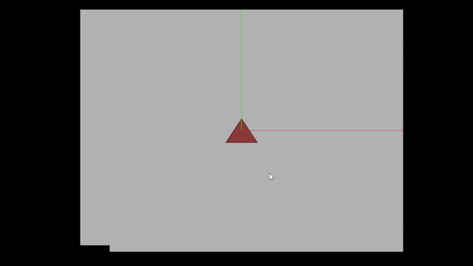

# OpenGL-Pyramid-Demo

This project provides an interactive 3D visualization using the OpenGL library, demonstrating a rotating pyramid with labeled vertices and an adjustable observer point.



## Table of Contents

- [Introduction](#introduction)
- [Features](#features)
- [Getting Started](#getting-started)
- [Usage](#usage)

## Introduction

This project showcases a simple 3D visualization using Python and OpenGL. It includes a pyramid rendered with shading, labeled vertices, an adjustable observer point, and toggleable perspective projection. The visualization is designed to demonstrate fundamental concepts of computer graphics and interactive 3D graphics.

## Features

- Interactive 3D visualization of a rotating pyramid.
- Labeled vertices and an observer point for better understanding.
- Toggleable perspective and orthographic projection.
- Customizable colors, lighting, and background.
- Axes for orientation reference.

## Getting Started

1. Clone the repository:

   ```sh
   git clone https://github.com/Aayush518/OpenGL-Pyramid-Demo.git
   cd OpenGL-Pyramid-Demo
   ```

2. Install the required dependencies:

   ```sh
   pip install pygame PyOpenGL
   ```

## Usage

1. Run the main script:

   ```sh
   python main.py
   ```

2. Interaction:

   - Use arrow keys to adjust the observer's position.
   - Press 'P' to toggle between perspective and orthographic projection.
   - Press 'R' to rotate the scene.

3. Customize:

   - Modify the colors, materials, and rendering settings in the respective files.

---

_This project was created as part of a computer graphics exploration. Feel free to use it for learning, personal projects, or as a foundation for more advanced visualizations._
```
